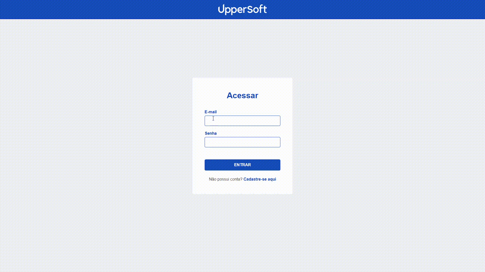

<div align="center">
  
</div>

<h1 align="center" style="margin-top: 30px;">InPeace - Teste estágio Front End</h1>

<h2 >📝 Sobre o Projeto</h2>
Simular uma apicação que consiste em gerenciar os usuários do sistema.</br>
Link para acessar o projeto: [`InPeace Teste`](http://teste-in-peace.vercel.app/)</br>

<h2 style="margin-top: 30px">🚀 Tecnologias</h2>
HTML, SCSS, JavaScript e Axios

<h2 style="margin-top: 30px">✅ Requisitos do Projeto</h2>
<strong>Principais:<strong>
<ul>
  <li>✅ Apresentar três paginas Login, Cadastro e Administrar Usuários</li>
  <li>✅ O header (barra superior azul com a logo) deverá ser fixa no topo da tela quando houver scroll</li>
  <li>✅ A tela deverá ser responsiva (desktop e mobile), ajustando o conteúdo conforme o tamanho da tela.</li>
  <li>✅ O botão de editar, no card de usuário na tela de Lista de Usuários, não precisa executar nenhuma ação, mas deve existir em forma de botão.</li>
  <li>✅ Não deve ser utilizado nenhum framework de front-end ou estilo (Bootstrap, Tailwind, Vue.js, React ou outros).</li>
  <li>✅ Na tela de Login, deve ser possível inserir o E-mail e Senha e, após clicar no botão de entrar, deverá haver o direcionamento para a tela de Lista de Usuários.</li>
  <li>✅ Na tela de Login, deve ser possível inserir os campos solicitados e, após clicar no botão de entrar, deverá haver o direcionamento para a tela de Lista de Usuários. Ao clicar em "cadastre-se aqui" deverá ser redirecionado para a tela de Cadastro.</li>
  <li>✅ Na tela de Cadastro, deve ser possível inserir os campos solicitados e, após clicar no botão de cadastrar, deverá haver o direcionamento para a tela de Login.  Ao clicar em "entre aqui" deverá ser redirecionado para a tela de Login.</li>
</ul>
<strong>Bonus:<strong>
<ul>
  <li>✅ Armazenar o e-mail e senha cadastrados na SessionStorage e validar estas informações ao realizar login, permitindo o acesso a tela de Lista de Usuários somente se os dados forem válidos.</li>
  <li>✅ Simular os dados da lista de usuário realizando a integração com uma API fake (https://reqres.in/).</li>
  <li>✅ Utilização do Axios para as requests.</li>
  <li>✅ Loading enquanto aguarda resposta da API.</li>
  <li>✅ Utilização de NPM/Yarn para instalação de bibliotecas.</li>
  <li>✅ Utilização de pré-processador de CSS (SASS/SCSS)</li>
</ul>

<h2 style="margin-top: 30px">📁 Como baixar o projeto</h2>

```bash
# Clonar o repositório
$ git clone https://github.com/EduardoAguiarS/Teste-InPeace.git
$ cd Teste-InPeace
$ Open this folder in your code editor
$ Open the index.html file using Live Server
```

<h2 style="margin-top: 30px">🖼️ Preview<h2>
<div align="center">
  
</div>
